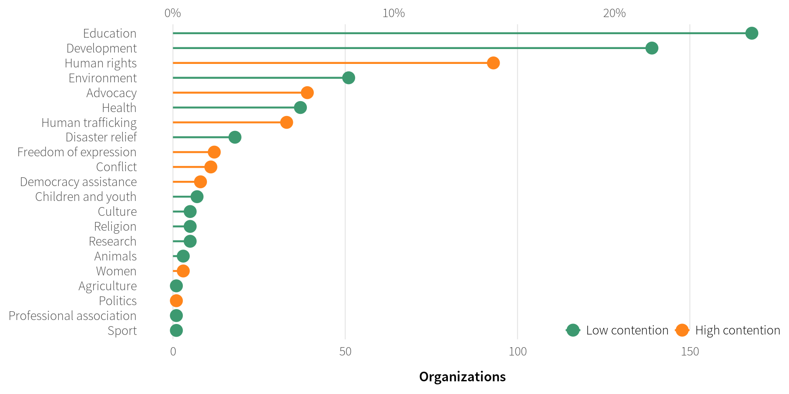
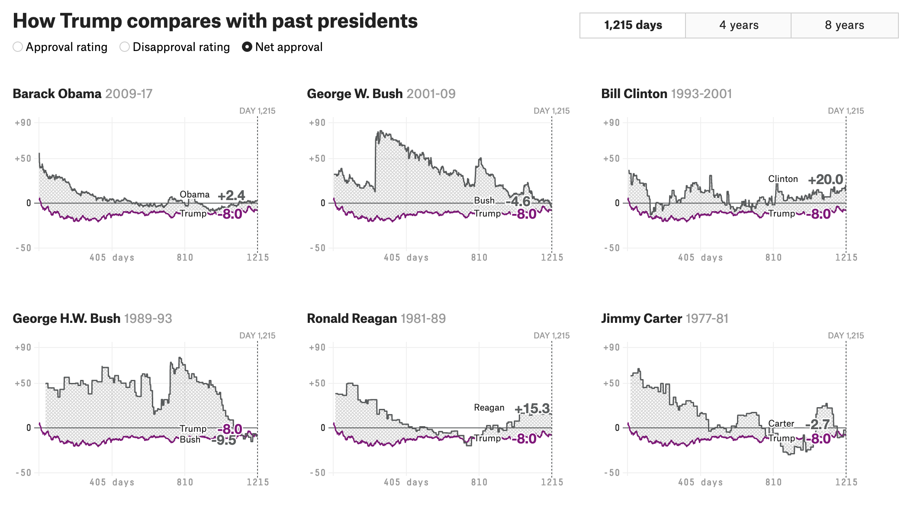
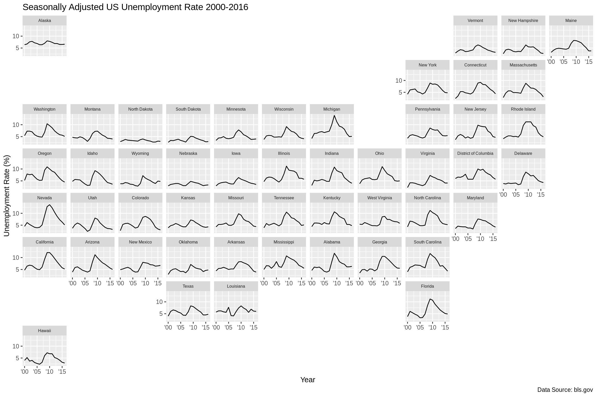
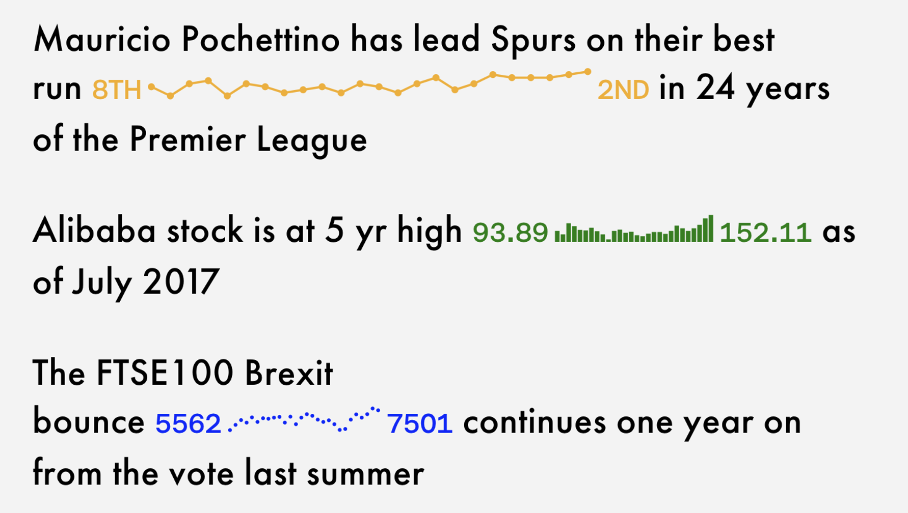
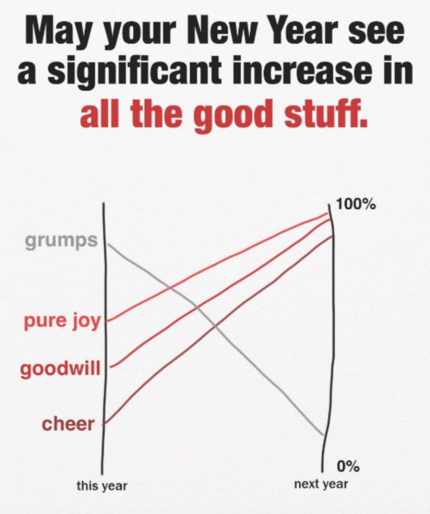
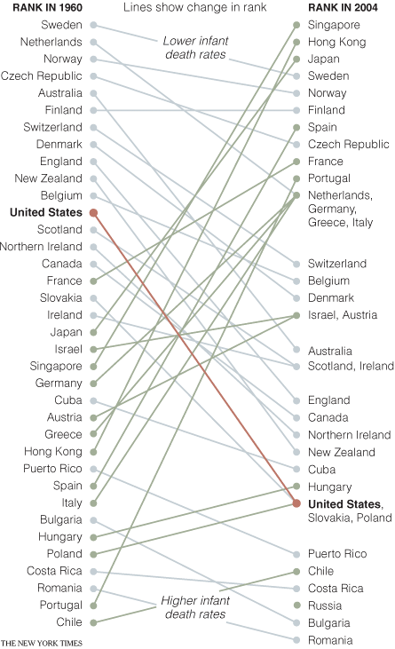
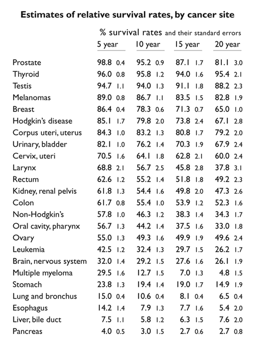
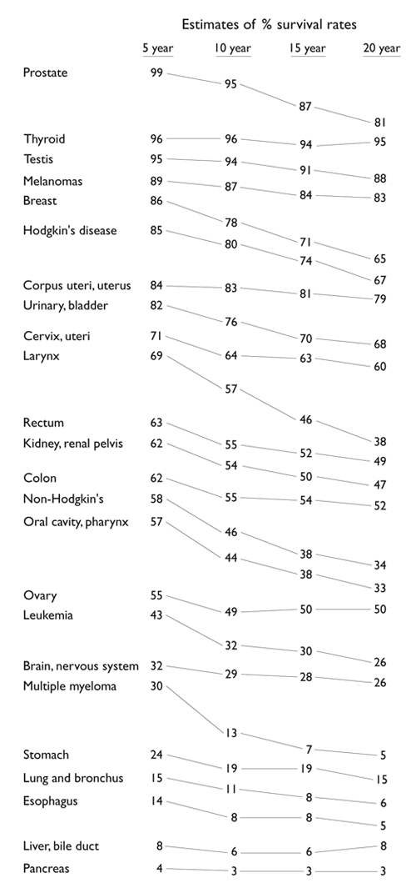
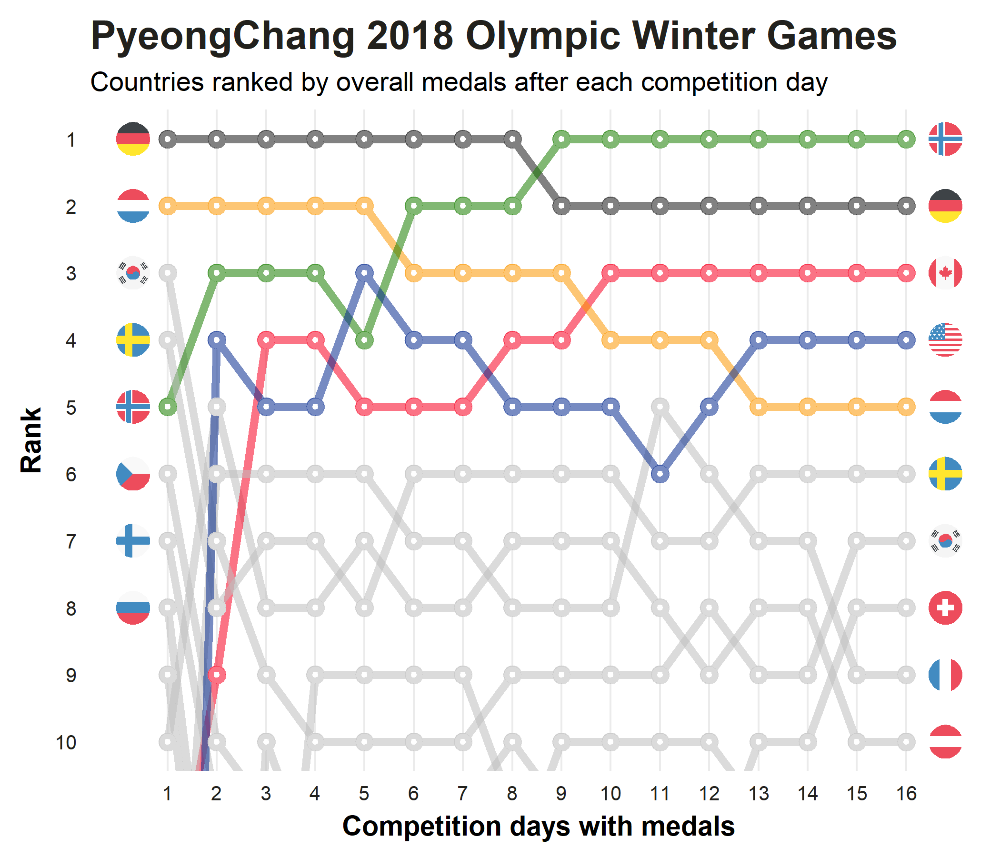

```{r setup, include=FALSE}
knitr::opts_chunk$set(warning = FALSE, message = FALSE, 
                      fig.retina = 3, fig.align = "center")
```

```{r packages-data, include=FALSE}
library(tidyverse)
set.seed(1234)
```

```{r xaringanExtra, echo=FALSE}
xaringanExtra::use_xaringan_extra(c("tile_view", "share_again"))
```

class: center middle main-title section-title-4

# Comparisons &<br>Logistic Regression

.class-info[

**Session 8**

.light[ISS Data Visualization with R<br>
Faculty of International Social Sciences, Gakushuin University<br>
Spring 2026]

]

---

name: outline
class: title title-inv-7

# Plan for today

--

.box-2.medium.sp-after-half[Visualizing comparisons]

--

.box-5.medium.sp-after-half[Small multiples as a bridge]

--

.box-4.medium.sp-after-half[Probability, odds & logistic regression]

---

layout: false
name: comparisons
class: center middle section-title section-title-2 animated fadeIn

# Visualizing comparisons

---

layout: true
class: title title-2

---

# Lollipops and bars

.center[
<figure>
  
</figure>
]

---

layout: false
class: bg-full
background-image: url("img/08/life_expectancy_sparklines.png")

???

Source: [FlowingData](https://flowingdata.com/2017/01/24/one-dataset-visualized-25-ways/02-time-series-sparklines-2/)

---

layout: true
class: title title-2

---

# Small multiples

.center[
<figure>
  
  <figcaption><a href="https://projects.fivethirtyeight.com/trump-approval-ratings/" target="_blank">FiveThirtyEight, Trump approval ratings</a></figcaption>
</figure>
]

???

Source: [FiveThirtyEight](https://projects.fivethirtyeight.com/trump-approval-ratings/)

---

# Small multiples with larger shapes

.center[
<figure>
  
  <figcaption><code>facet_geo()</code> in the <a href="https://hafen.github.io/geofacet/" target="_blank"><strong>geofacet</strong> package</a></figcaption>
</figure>
]

---

# Sparklines

.pull-left-wide[
<figure>
  
</figure>
]

.pull-right-narrow[
<figure>
  
</figure>
]

???

In-text sparklines from the now-retired [Sparks project](http://tools.aftertheflood.com/sparks/)

[Apple Watch example](https://www.edwardtufte.com/bboard/q-and-a-fetch-msg?msg_id=0001OR)

---

# Slopegraphs

.center[
<figure>
  
</figure>
]

???

Original by [Stephanie Evergreen](https://www.zazzle.com/slopegraph_holiday_card_for_data_nerds-137238378061787506?rf=238910033403516222)

---

# Slopegraphs

.center[
<figure>
  
</figure>
]

???

https://archive.nytimes.com/www.nytimes.com/imagepages/2009/04/06/health/infant_stats.html

---

# Slopegraphs

.pull-left[
<figure>
  
</figure>
]

.pull-right[
<figure>
  
</figure>
]

???

https://www.edwardtufte.com/bboard/q-and-a-fetch-msg?msg_id=0000Jr

---

# Bump charts

.center[
<figure>
  
</figure>
]

???

<https://dominikkoch.github.io/Bump-Chart/>

---

layout: false
name: small-multiples-bridge
class: center middle section-title section-title-5 animated fadeIn

# Small multiples

---

layout: true
class: title title-5

---

# The core principle

.pull-left[
.box-inv-5[**One chart per group**]

.box-inv-5[**Identical axes everywhere**]

.box-inv-5[**Comparison is spatial**]

.box-inv-5[**`facet_wrap()` in ggplot2**]
]

.pull-right[
> "Illustrations of postage-stamp size are indexed by category or a label, encoded with not more than two or three variables, and placed within the eyespan."
>
> — Edward Tufte, *Envisioning Information*
]

---

# Why not one chart?

.pull-left[
.box-inv-5.small[**One chart — hard to read**]

.center[
Four groups, four colours, overlapping lines,<br>busy legend — the comparison is buried
]
]

--

.pull-right[
.box-5.small[**Small multiples — easy to read**]

.center[
Same four groups, one panel each —<br>differences jump out spatially
]
]

--

.box-inv-5.medium.sp-before[The eye does the comparison work.<br>You don't have to decode a legend.]

---

# Small multiples → logistic regression

.box-inv-5[We've seen small multiples for **comparing distributions**]

--

.box-inv-5[They work just as well for comparing **model predictions**]

--

.box-inv-5[A logistic regression with a **moderator** produces one predicted curve per group]

--

.box-5.medium.sp-before[`facet_wrap(~ group)` turns a<br>moderation effect into a small multiples plot]

---

layout: false
name: logistic
class: center middle section-title section-title-4 animated fadeIn

# Probability, odds &<br>logistic regression

---

layout: true
class: title title-4

---

# 1. Start with probability

.pull-left[
.box-inv-4[**Probability (p)**]

How likely something is to happen

Ranges from **0** (never) to **1** (always)

.sp-after[&nbsp;]

**Example:**

75% chance of winning a game

$$p = 0.75$$
]

--

.pull-right[
.box-4[But probabilities have a problem...]

For regression, we need outcomes that can range from $-\infty$ to $+\infty$

Probabilities are **stuck between 0 and 1**

We need a way to **unlock** them
]

---

# 2. Odds

.pull-left[
Odds compare the chance of something **happening** to it **not happening**:

$$\text{Odds} = \frac{p}{1 - p}$$

**Example:** if $p = 0.75$

$$\text{Odds} = \frac{0.75}{0.25} = 3$$

The event is **3 times more likely** to happen than not
]

--

.pull-right[
.box-inv-4[**Key intuitions**]

.box-4.small[Odds = 1 → equal chance (coin flip)]

.box-4.small[Odds > 1 → event more likely]

.box-4.small[Odds < 1 → event less likely]

Odds are **always positive** — not quite what we need
]
---


# 3. Log odds

Taking the **logarithm** of odds gives something that can be negative, zero, or positive:

$$\text{Log Odds} = \ln(\text{Odds}) = \ln\!\left(\frac{p}{1-p}\right)$$

.pull-left[
.box-inv-4[**Examples**]

If Odds = 3 → $\ln(3) \approx 1.10$

If Odds = 1 → $\ln(1) = 0$

If Odds < 1 → **negative**
]

.pull-right[
.box-4[**Why log odds?**]

Odds are always positive

Log odds can be **negative, zero, or positive**

Compatible with linear regression
]

---

# 4. The logit function

.pull-left[
The **logit** transforms probability into log odds:

$$\text{logit}(p) = \ln\!\left(\frac{p}{1-p}\right)$$

.box-inv-4[Probabilities are **stuck**: 0 to 1]

.box-inv-4[Logit **unlocks** them: −∞ to +∞]

| p | logit(p) |
|---|---|
| 0.10 | −2.20 |
| 0.50 | &nbsp;0.00 |
| 0.75 | &nbsp;1.10 |
| 0.90 | &nbsp;2.20 |
]

.pull-right[
```{r logit-plot, echo=FALSE, fig.height=4.0, fig.width=5.5}
library(ggplot2)
library(tibble)

annotations <- tibble(
  p     = c(0.10, 0.50, 0.75, 0.90),
  logit = c(-2.20, 0.00, 1.10, 2.20),
  label = c("p=0.10\nlogit=−2.20",
            "p=0.50\nlogit=0",
            "p=0.75\nlogit=1.10",
            "p=0.90\nlogit=2.20")
)

tibble(p = seq(0.01, 0.99, 0.005),
       logit = log(p / (1 - p))) |>
  ggplot(aes(x = p, y = logit)) +
  geom_hline(yintercept = 0, linetype = "dashed",
             colour = "grey60", linewidth = 0.6) +
  geom_vline(xintercept = 0.5, linetype = "dashed",
             colour = "grey60", linewidth = 0.6) +
  geom_line(colour = "#185FA5", linewidth = 1.4) +
  geom_point(data = annotations,
             aes(x = p, y = logit),
             colour = "#D85A30", size = 3) +
  geom_label(data = annotations,
             aes(x = p, y = logit, label = label),
             hjust = c(1.1, 1.1, -0.1, -0.1),
             vjust = 0.5, size = 3, colour = "#D85A30",
             fill = "white", label.size = 0.2) +
  annotate("text", x = 0.15, y = 3.8,
           label = "p > 0.5 → logit > 0",
           colour = "grey40", size = 3.2, hjust = 0) +
  annotate("text", x = 0.15, y = -3.8,
           label = "p < 0.5 → logit < 0",
           colour = "grey40", size = 3.2, hjust = 0) +
  scale_x_continuous(labels = scales::percent_format(accuracy = 1)) +
  labs(x = "Probability (p)", y = "logit(p) — log odds") +
  theme_minimal(base_size = 12) +
  theme(panel.grid.minor = element_blank())
```
]
---

# 5. A worked example: free throws

.pull-left[
A basketball player: **75% chance** of a free throw → $p = 0.75$

**Odds:** $\dfrac{0.75}{0.25} = 3$ &nbsp; (3× more likely than miss)

**Log odds:** $\ln(3) \approx 1.10$
]

.pull-right[
.box-inv-4[**Three ways to say the same thing**]

.box-4.small[**Probability:** 75% chance<br>*(intuitive, limited to 0–1)*]

.box-4.small[**Odds:** 3 to 1 in favour<br>*(success vs. failure)*]

.box-4.small[**Log odds:** 1.10<br>*(usable in regression)*]
]
---

# The logistic S-curve

```{r scurve-plot, echo=FALSE, fig.height=4.2, fig.width=9}
library(ggplot2)
library(tibble)
library(dplyr)

# Show two curves: one steep (β1 large), one shallow (β1 small)
crossing(
  x    = seq(-6, 6, length.out = 300),
  type = c("Weak predictor (β₁ = 0.8)", "Strong predictor (β₁ = 2.5)")
) |>
  mutate(
    b1 = if_else(type == "Strong predictor (β₁ = 2.5)", 2.5, 0.8),
    p  = plogis(b1 * x)
  ) |>
  ggplot(aes(x = x, y = p, colour = type)) +
  geom_hline(yintercept = c(0, 1), linetype = "dotted",
             colour = "grey70", linewidth = 0.5) +
  geom_hline(yintercept = 0.5, linetype = "dashed",
             colour = "grey50", linewidth = 0.6) +
  geom_line(linewidth = 1.4) +
  annotate("text", x = 0.15, y = 0.53,
           label = "p = 0.5 (decision boundary)",
           colour = "grey40", size = 3.5, hjust = 0) +
  scale_colour_manual(values = c("#B5D4F4", "#185FA5"),
                      name = NULL) +
  scale_y_continuous(labels = scales::percent_format(accuracy = 1),
                     limits = c(0, 1)) +
  labs(
    title = "The logistic curve is always bounded between 0 and 1",
    x     = "Value of predictor (x)",
    y     = "P(outcome)"
  ) +
  theme_minimal(base_size = 13) +
  theme(legend.position = "bottom",
        panel.grid.minor = element_blank())
```

---

# 6. The logistic model

For a binary outcome $y$ and predictor $x$: &nbsp; $\text{logit}(p) = \beta_0 + \beta_1 x$

Because the logit is invertible: &nbsp; $p = \dfrac{e^{\beta_0 + \beta_1 x}}{1 + e^{\beta_0 + \beta_1 x}}$

.pull-left[
.box-inv-4[S-shaped logistic curve]

.box-inv-4[Always bounded between 0 and 1]

.box-inv-4[$\beta_0, \beta_1$ estimated via `glm()`]
]

.pull-right[
.box-4[**Admissions example**]

$$\text{logit}(p) = -12.04 + 4.08 \times \text{GPA}$$

Each 1-point GPA rise multiplies odds by $e^{4.08} \approx 59$
]
---

# From theory to code

.box-inv-4[In R, logistic regression uses `glm()` with `family = "binomial"`]

```r
model <- glm(admitted ~ gpa,
             data   = admissions,
             family = "binomial")
```

.pull-left[
.box-4.small[`glm()` = Generalised Linear Model]
.box-4.small[`family = "binomial"` = binary outcome]
.box-4.small[`"logit"` link is the default]
]

.pull-right[
.box-inv-4.small[See the practical session for model fitting, evaluation, confusion matrices, and small multiples of predictions]
]
